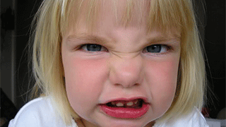

[](https://travis-ci.org/bastole/dc-richmedia-automation-template) [](https://snyk.io/test/github/bastole/dc-richmedia-automation-template/aab318b50244990268ac85d6b2981a1188f8ac0d)

DRAT - [DoubleClick Richmedia](https://www.google.com/doubleclick/studio/) Automation Template
=======================




* [Grunt](http://gruntjs.com/) based build template for developing multiple [DoubleClick](https://www.google.com/doubleclick/studio/) rich banners simultaneously.

#### Features

* Build multiple banners simultaneously.
* Polite-loads every asset.
* Optimizes image on build.
* Uses hosted GSAP that doesn't count towards the max filesize.
* Peview banners with play, pause, rewind and timeline slider.
* Generate back-up GIFs with a single click.
* Detects Ad Blocker

#### Requirements

[NodeJS](https://nodejs.org/), [Grunt](http://gruntjs.com/), [Sass](http://sass-lang.com/install)

Setting up development environment
----------------------------------

#### Install

```
$ npm install

```

#### Generate build environment

Run:

```
$ grunt create

```


To start the questions again, run:
```
$ grunt reset
```
...or manually update config.json.

#### Start building banners

Run grunt (default) to have the watcher build sass, js and images as you work:

```
$ grunt
```

#### Other Grunt Tasks

```
$ grunt - Processes banners to public/
$ grunt clean:reset - Deletes build/ and public/
$ grunt prompt - Creates config.json
$ grunt setUp - Creates build/ and public/preview.html
$ grunt reset - prompt, clean:reset, setUp
$ grunt restart - clean:reset, setUp, grunt
$ grunt zip - Creates /zipped folder and compressed banners

```


#### /build folder

You can see in the build folder that all banner sub-folders are created.

* /build/shared - Shared js and sass across all banners.

* /build/bannerName/images - image assets used for the banner. images will be processed and copied to /public.

* /build/bannerName/_animate.js - Preload assets and animate.

* /build/bannerName/init_dcs.js - DoubleClick Enabler listener and polite-loads GSAP.

#### /public folder

dispatch-ready banners. All you have to do is drag each folder into [DoubleClick Studio UI](https://www.google.com/doubleclick/studio/).

#### /zipped folder

banners in .zip files. It's safer and much faster to upload compressed files to DoubleClick. 

#### /etc folder
.


License
---------------------------------------

The code is available under the [MIT license](LICENSE.md).
